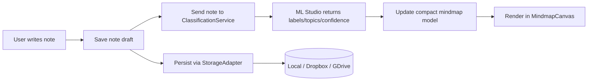

# Architecture Spec (Agent-Friendly)

## 0) Metadata
```yaml
spec_id: astrocyte-architecture-v1
language: sv-SE
status: draft
last_updated: 2026-04-04
owners:
  - product
  - engineering
runtime:
  frontend: React
  hosting: GitHub Pages (statisk webbapp)
```

## 1) Produktmål
```yaml
product_goal:
  summary: "Anteckningsapp som automatiskt klassificerar anteckningar och visualiserar en mindmap."
  core_capabilities:
    - "Skapa, läsa, uppdatera, ta bort anteckningar"
    - "Automatisk klassificering av anteckning via lokal LLM"
    - "Visualisering av ämnen/relaterade anteckningar som bubbel-mindmap"
```

## 2) Plattform & deploy
```yaml
platform:
  app_type: "Single Page Application"
  framework: "React"
  build_tooling: "Vite (rekommenderat)"
  deploy_target: "GitHub Pages"
  static_constraints:
    - "Ingen egen server krävs för grundflödet"
    - "All konfiguration lagras klientnära (localStorage/IndexedDB)"
```

## 3) UI-struktur
```yaml
ui:
  layout:
    left_sidebar:
      required: true
      common_pattern: "Modern vänstermeny"
      bottom_action:
        id: settings_gear
        icon: "kugghjul"
        position: "längst ner"
        behavior: "Öppna Settings-vy/modal"
    main_content:
      primary_view: "Mindmap med bubblor"
      secondary_views:
        - "Anteckningseditor"
        - "Anteckningslista/filter"
```

## 4) Settings-krav
```yaml
settings:
  storage_provider:
    description: "Användaren väljer var anteckningar sparas"
    supported_options:
      - id: local
        label: "Lokal lagring"
      - id: dropbox
        label: "Dropbox"
      - id: gdrive
        label: "Google Drive"
    fields:
      - provider
      - oauth_connected
      - sync_mode   # manual | periodic
      - sync_interval_minutes
  llm:
    description: "Lokal LLM-konfiguration till ML Studio-server"
    fields:
      - base_url            # ex: http://127.0.0.1:1234
      - model_name
      - api_key_optional
      - timeout_ms
      - max_tokens
      - temperature
      - classification_prompt_template
    healthcheck:
      endpoint: "/health eller /v1/models (konfigurerbart)"
      ui_action: "Test Connection"
```

## 5) Komponentkarta (React)
```yaml
react_components:
  - name: AppShell
    responsibility: "Grid/layout + routing"
  - name: Sidebar
    responsibility: "Navigation + kugghjul längst ned"
  - name: SettingsPanel
    responsibility: "Konfigurera storage + LLM"
  - name: NoteEditor
    responsibility: "Skapa/redigera anteckning"
  - name: NotesList
    responsibility: "Lista/sök/filter anteckningar"
  - name: MindmapCanvas
    responsibility: "Rendera noder/bubblor och länkar"
  - name: ClassificationService
    responsibility: "Anropa ML Studio för klassificering"
  - name: StorageAdapter
    responsibility: "Gemensamt interface för Local/Dropbox/GDrive"
```

## 6) Dataflöde


## 7) Mindmap-datamodell (kompakt + LLM-vänlig)

### 7.1 Principer
```yaml
mindmap_model_principles:
  - "Kompakt JSON för låg tokenkostnad"
  - "Separata objekt för nodes och edges"
  - "Minimal men tillräcklig metadata för rendering"
  - "Stabil identifiering via korta IDs"
```

### 7.2 JSON-schema (praktiskt format)
```json
{
  "version": "1.0",
  "notes": [
    {
      "id": "n_01",
      "title": "Teststrategi för API",
      "text": "Kort sammanfattning av anteckningen...",
      "tags": ["jobb", "test", "api"],
      "ts": "2026-04-04T10:15:00Z"
    }
  ],
  "topics": [
    {
      "id": "t_jobb",
      "label": "Jobb",
      "score": 0.97,
      "parent": null
    },
    {
      "id": "t_jobb_kod",
      "label": "Kod",
      "score": 0.91,
      "parent": "t_jobb"
    },
    {
      "id": "t_jobb_test",
      "label": "Test-förfarande",
      "score": 0.95,
      "parent": "t_jobb"
    }
  ],
  "edges": [
    { "from": "n_01", "to": "t_jobb", "type": "classified_as", "w": 0.97 },
    { "from": "n_01", "to": "t_jobb_test", "type": "mentions", "w": 0.88 },
    { "from": "t_jobb_kod", "to": "t_jobb", "type": "child_of", "w": 1.0 }
  ],
  "clusters": [
    {
      "id": "c_jobb",
      "label": "Jobb",
      "root_topic": "t_jobb",
      "size": 42,
      "children": ["t_jobb_kod", "t_jobb_test"]
    }
  ]
}
```

### 7.3 Rendering-regler för bubblor
```yaml
rendering_rules:
  node_size:
    topic: "baseras på antal kopplade notes + ackumulerad vikt"
    note: "konstant eller svagt skalad"
  node_color:
    by_cluster: true
  edge_visibility:
    threshold_w: 0.55
  layout:
    algorithm: "force-directed"
    preserve_positions: true
```

## 8) Klassificering (ML Studio)
```yaml
classification_pipeline:
  input:
    - note_title
    - note_text
    - optional_context_summary
  output:
    - topics[]
    - confidence_per_topic
    - optional_reasoning_short
  constraints:
    - "Svar ska kunna mappas direkt till topics/edges"
    - "Undvik långa fritextsvar"
```

Exempel på strikt svarskontrakt:
```json
{
  "topics": [
    {"label": "Jobb", "score": 0.97},
    {"label": "Kod", "score": 0.91},
    {"label": "Test-förfarande", "score": 0.95}
  ]
}
```

## 9) Adapter-interface för lagring
```ts
export interface StorageAdapter {
  init(): Promise<void>;
  saveNote(note: Note): Promise<void>;
  listNotes(): Promise<Note[]>;
  deleteNote(noteId: string): Promise<void>;
  exportMindmap(): Promise<MindmapModel>;
  importMindmap(model: MindmapModel): Promise<void>;
}
```

## 10) Milstolpar
```yaml
roadmap:
  m1:
    name: "Lokal MVP"
    includes:
      - React app shell
      - Sidebar + settings-kugghjul
      - Local storage adapter
      - Grundläggande mindmap-rendering
  m2:
    name: "LLM-klassificering"
    includes:
      - ML Studio config + connection test
      - Automatisk topic/edge-generering
  m3:
    name: "Cloud sync"
    includes:
      - Dropbox adapter
      - Google Drive adapter
      - Konflikthantering vid sync
```
